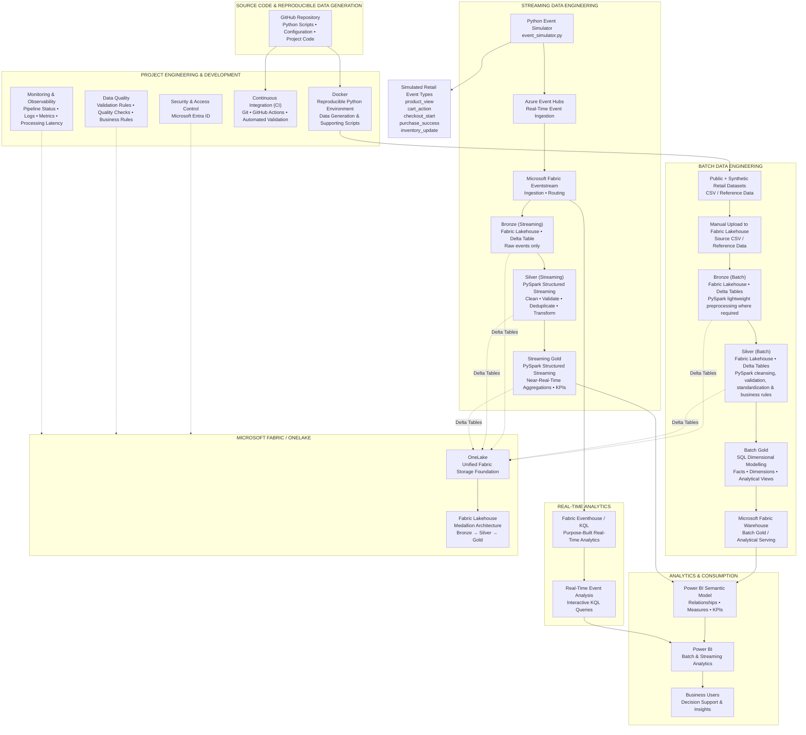

# Ubuntu Unified Retail Data Platform — Project Architecture


## 1. High-Level Architecture

The following diagram represents the implemented project architecture, separating the **batch and streaming data paths** from the **project engineering and development tooling**.

> **Note:** The diagram is intentionally larger than the surrounding diagrams. If your Markdown viewer supports Mermaid overflow scrolling, the architecture can be viewed using the horizontal and vertical scroll bars rather than requiring excessive zooming.

<div style="overflow:auto; width:100%; max-height:900px; border:1px solid #ddd; padding:10px;">



</div>

---


## 2. Streaming Architecture

The implemented streaming path is:

```text
Python Event Simulator
        │
        ▼
Azure Event Hubs
        │
        ▼
Microsoft Fabric Eventstream
        │
        ├───────────────────────────────┐
        │                               │
        ▼                               ▼
Bronze (Streaming)                Fabric Eventhouse
Lakehouse Delta Table             / KQL
Raw Events                        Real-Time Analytics
        │
        ▼
PySpark Structured Streaming
        │
        ▼
Silver (Streaming)
Cleaned / Validated / Deduplicated
        │
        ▼
PySpark Structured Streaming
        │
        ▼
Streaming Gold
Near-Real-Time Aggregations
Real-Time KPIs
        │
        ▼
Power BI Semantic Model
        │
        ▼
Power BI
Retail Streaming Analytics
```

### Streaming Event Types

The Python event simulator generates:

- `product_view`
- `cart_action`
- `checkout_start`
- `purchase_success`
- `inventory_update`

### Important Implementation Detail

**Bronze Streaming is a raw landing layer.**

No PySpark transformations are performed in Bronze Streaming.

The raw events are written to the Bronze Delta table by **Fabric Eventstream**.

Transformations begin downstream in **Silver Streaming**, using **PySpark Structured Streaming**.

---

## 3. Batch Architecture

```text
Public / Synthetic CSV Data
        │
        ▼
Python Data Preparation
        │
        ▼
Manual Upload to Fabric Lakehouse
        │
        ▼
Bronze (Batch)
Fabric Lakehouse / Delta Tables
        │
        │ PySpark
        ▼
Silver (Batch)
Cleaned / Validated / Standardized
        │
        │ SQL
        ▼
Batch Gold
Facts / Dimensions / Analytical Views
        │
        ▼
Microsoft Fabric Warehouse
        │
        ▼
Power BI Semantic Model
        │
        ▼
Power BI
```

---


## 4. Medallion Architecture

```text
                         MICROSOFT FABRIC
                                │
                              ONELAKE
                                │
                        FABRIC LAKEHOUSE
                                │
                 ┌──────────────┴──────────────┐
                 │                             │
               BATCH                       STREAMING
                 │                             │
                 ▼                             ▼
          BRONZE (BATCH)              BRONZE (STREAMING)
                 │                             │
           PySpark                  PySpark Structured
      Lightweight Processing              Streaming
                 │                             │
                 ▼                    Raw Event Processing
          SILVER (BATCH)                       │
                 │                             ▼
             PySpark                  SILVER (STREAMING)
       Transform & Validate                    │
                 │                    PySpark Structured
                 │                        Streaming
                 │                             │
                 │                    Transform / Validate /
                 │                    Deduplicate / Enrich
                 │                             │
                 ▼                             ▼
            BATCH GOLD                  STREAMING GOLD
                 │                             │
                SQL                    Streaming Analytics
                 │                             │
        Dimensional Modelling                 │
                 │                             │
                 ▼                             ▼
        FABRIC WAREHOUSE                 POWER BI
```

---

## 5. Real-Time Analytics Alternative / Complement

The platform deliberately demonstrates two complementary real-time paths:

```text
                    Fabric Eventstream
                           │
              ┌────────────┴────────────┐
              │                         │
              ▼                         ▼
     Lakehouse Streaming         Fabric Eventhouse
          Pipeline                    / KQL
              │                         │
              ▼                         ▼
       Bronze → Silver →          Real-Time
       Streaming Gold             Analytics
              │
              ▼
           Power BI
```

### Architectural Decision

The **Lakehouse path** is the primary streaming data-engineering architecture.

The **Eventhouse/KQL path** complements it with a purpose-built environment for low-latency, interactive real-time analytics.

---

## 6. Analytics Layer

```text
Batch Gold ───────────────────────┐
                                  │
Streaming Gold ──────────────────┼──► Power BI Semantic Model
                                  │
                                  └──► Power BI Analytics

Eventhouse / KQL ─────────────────────► Real-Time Analytics
```

### Streaming Gold KPIs

The Streaming Gold / Power BI experience includes real-time-oriented metrics such as:

- Total Events
- Product Views
- Cart Actions
- Checkout Starts
- Purchases
- Checkout → Purchase Rate
- Average Processing Delay
- Event activity by event type
- Event activity by country

---

## 7. Platform Engineering & Governance


```text
                                 PROJECT ENGINEERING
                           │
          ┌────────────────┼─────────────────┐
          │                │                 │
          ▼                ▼                 ▼
      Orchestration    Monitoring       Data Quality
                       & Observability    & Testing
          │                │                 │
          └────────────────┼─────────────────┘
                           │
                           ▼
                       Security
                           │
                           ▼
              Continuous Integration (CI)
                       GitHub Actions


              ┌───────────────────────────┐
              │                           │
              ▼                           ▼
       GitHub Repository              Docker
              │                           │
              │                           ▼
              │                  Reproducible Python
              │                     Environment
              │                           │
              │                           ▼
              │                  Data Generation &
              │                  Supporting Scripts
              │                           │
              └──────────────────────────►│
                                          ▼
                                  Generated Data
```


---

## 9. Technology Responsibilities

| Technology | Primary Responsibility |
|---|---|
| Python | Dataset preparation, synthetic data generation, event simulation |
| Fabric Pipelines | Notebook orchestration for batch processing |
| Azure Event Hubs | Real-time event ingestion |
| Fabric Eventstream | Streaming ingestion, processing and routing |
| Fabric Lakehouse | Central Bronze/Silver/Gold data-engineering environment |
| OneLake | Unified Fabric storage foundation |
| Delta Lake | Lakehouse table/storage format |
| PySpark | Batch Bronze/Silver processing |
| PySpark Structured Streaming | Streaming Silver and Streaming Gold processing |
| Fabric Warehouse | Batch Gold analytical serving |
| SQL | Batch Gold dimensional modelling and analytical queries |
| Fabric Eventhouse / KQL | Purpose-built real-time analytics |
| Semantic Model | Business relationships, measures and KPIs |
| Power BI | Analytics, dashboards and business consumption |
| Git / GitHub | Source control |
| GitHub Actions | Continuous Integration (CI) and automated engineering checks |
| Docker | Reproducible containerized execution |
```

## 10. Architecture Summary

The platform demonstrates a unified enterprise-style data platform that supports both **batch data engineering and simulated real-time data engineering**.

The batch architecture uses manually uploaded source data and Fabric pipeline orchestration for the downstream notebook-based processing:

**Source Datasets → Manual Upload to Fabric Lakehouse → Bronze → Silver → Batch Gold → Fabric Warehouse → Power BI**

The streaming architecture is:

**Event Simulator → Event Hubs → Eventstream → Bronze Streaming → PySpark Structured Streaming → Silver Streaming → PySpark Structured Streaming → Streaming Gold → Power BI**

The same streaming events are also routed directly from Eventstream to:

**Eventstream → Eventhouse / KQL → Real-Time Analytics**

Together, these paths form the platform's unified batch and streaming architecture, with the Fabric Lakehouse providing the central medallion data-engineering environment.


